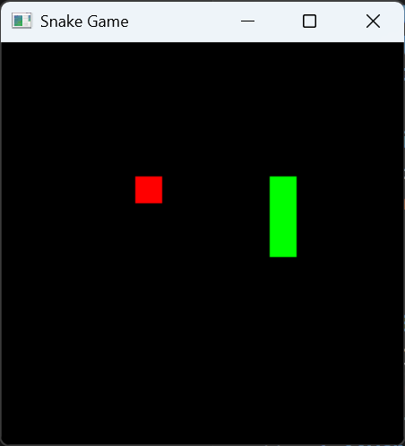

# 🐍 SnakeGame-OpenCV


一个基于 **C++17** 和 **OpenCV** 开发的经典贪吃蛇游戏。项目采用 **CMake** 构建系统，并推荐使用 **vcpkg** 进行依赖管理，支持跨平台编译。

---

## ✨ 项目特性
* **简洁流畅**：基于 OpenCV 绘图引擎，实现高性能渲染。
* **现代 C++**：使用 C++17 标准编写，代码结构清晰。
* **自动依赖管理**：支持 vcpkg 清单模式（Manifest Mode），一键安装 OpenCV。
* **跨平台**：兼容 Windows (MSVC) 和 Linux。

## 📸 运行截图
> 

---

## 🛠️ 环境要求
在开始之前，请确保你的开发环境已安装以下工具：
* **CMake** (版本 >= 3.18)
* **C++ 编译器** (支持 C++17，如 MSVC 2019+, GCC 9+, Clang 10+)
* **vcpkg** (推荐，用于自动安装 OpenCV)

---

## 🚀 快速开始

### 1. 克隆仓库
```bash
git clone https://github.com/durandal423/SnakeGame.git
cd SnakeGame
```

### 2. 使用 vcpkg 安装依赖并编译
本项目推荐使用 vcpkg 的清单模式。在配置 CMake 时指定你的 vcpkg 工具链路径即可。

Windows (PowerShell):
```PowerShell
# 请将 [vcpkg_root] 替换为你的 vcpkg 实际安装目录
cmake -B build -S . -DCMAKE_TOOLCHAIN_FILE="[vcpkg_root]/scripts/buildsystems/vcpkg.cmake"
cmake --build build --config Release
```
Linux/macOS:
```bash
cmake -B build -S . -DCMAKE_TOOLCHAIN_FILE="$VCPKG_ROOT/scripts/buildsystems/vcpkg.cmake"
cmake --build build
```

### 3. 运行游戏
编译完成后，在 build 文件夹下找到可执行文件并运行：
```bash
./build/SnakeGame
```

## 🎮 操作说明
- W / A / S / D 或 方向键：控制蛇的移动方向。

- ESC：退出游戏。

- R：游戏结束后重新开始。

## 📂 项目结构
```Plaintext
SnakeGame/
├── .vscode/             # VS Code 配置文件
├── cmake/               # 自定义 CMake 脚本 (如果有)
├── main.cpp             # 核心源代码
├── CMakeLists.txt       # CMake 构建定义
├── vcpkg.json           # 依赖清单
└── README.md            # 项目说明文档
```

## 🤝 贡献说明
1. 欢迎提交 Issue 或 Pull Request 来完善这个项目！

2. Fork 本仓库。

3. 创建你的特性分支 (git checkout -b feature/AmazingFeature)。

4. 提交你的修改 (git commit -m 'Add some AmazingFeature')。

5. 推送到分支 (git push origin feature/AmazingFeature)。

6. 开启一个 Pull Request。

## 📜 开源协议
本项目采用 MIT License 许可。

💡 提示：如果你在安装 OpenCV 时遇到网络问题，请尝试设置环境变量 X_VCPKG_ASSET_SOURCES 以使用国内镜像源。